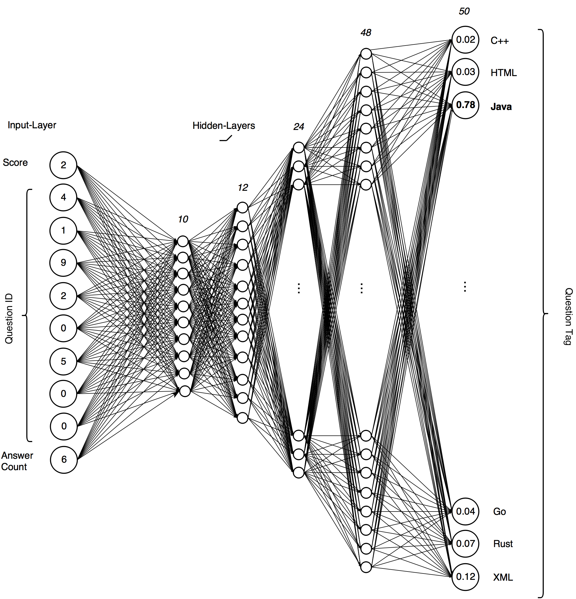
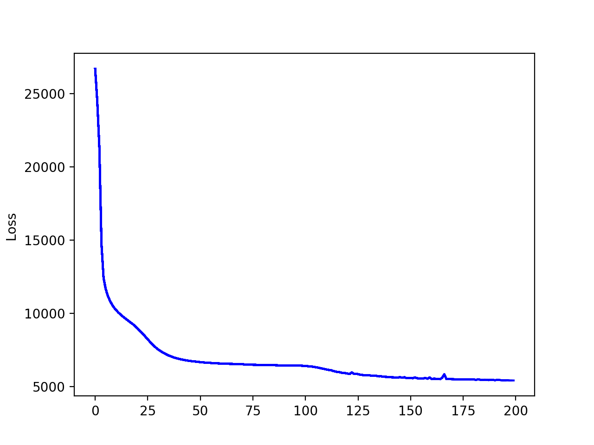

## Tagging Stack-Overflow questions with deep neural networks
Project idea from [Awesome Deep Learning Project Ideas](https://github.com/NirantK/awesome-project-ideas)

#### Data
The training data set was originally downloaded from ["StackLite: Stack Overflow questions and tags"](https://www.kaggle.com/stackoverflow/stacklite)
and are formally licenced by [Stack Exchange, Inc.](https://archive.org/details/stackexchange) under [cc-by-sa 3.0](http://creativecommons.org/licenses/by-sa/3.0/).
It contains the question score and answer count as well as the anonymous ID of its owner. The neural net tries to map this vector to one of the 50 frequently
used question tags like *java*, *c++* or *html*.

#### Neural network
The neural net was implemented as computational graph with the popular machine learning library [TensorFlow](https://www.tensorflow.org/). You can find my model in the following Python module:
[src/model.py](https://github.com/erohkohl/question-tagging/blob/master/src/model.py). The below picture shows the network architecture. It consists of four hidden layers with 10, 12, 24 and 48 neurons, where each neuron
has a [ReLU](https://en.wikipedia.org/wiki/Rectifier_(neural_networks)) activation. Further neural nets output layer holds one neuron
for each question tag and applies [Softmax](https://en.wikipedia.org/wiki/Softmax_function) function to their activation for classification purpose.


#### Train model
To train model, simply run the following command in the root folder of this project. Therefore Python 3
is recommended and Googles TensorFlow and [matplotlib](https://matplotlib.org/) are required.
```bash
$ python src/model.py
```

#### Results
This models reaches an accuracy of over **85%** for the train and test data set after 20000 iterations of training. The below picture shows models loss
in relation to its training epochs.


